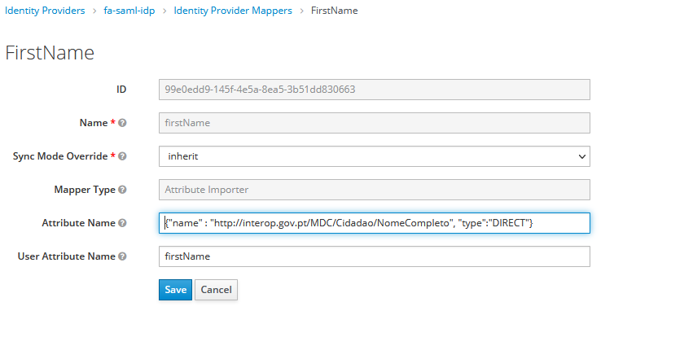

# Introduction

This extension allows configuring the a _SAML Identity Provider_ in _Keycloak_ where it is necessary to handle the _Attribute_ tags that are contained in _AttributeStatement_ tag that belongs to the _Assertion_ tag section in a _SAML Response_ tag.

This extension was specially made for integrating with _Fornecedor de Autenticação_ since it contains specific fields for it.

# General Workflow

The following image depicts the general workflows where the code is used.

## Initialization


## Login

## 

# Configuring an Identity Provider

## Creating a New Identity Provider

To create a new Identity Provider select _FA SAML v1.5.2 IDP_ entry.


Configure the _Identity Provider_ as usual for other _Identity Providers_ of the same kind.

## Specifying First Login Flow


See how to create this authentication bellow.

## Specifying Principal

To comply with RGPD and not storying any user attributes (that can be easily traced to the user), configure the principal as next:


*calculatedPrincipalAssertion* is a value defined in the project properties. The value used in _Principal Attribute_ must match the value in the property file.

## Specifying Requested Attributes

In the section _FA SAML Extension Configuration_ it is possible to specify which attributes are
being requested from the _Identity Provider_.


More information over this configuration available at:
[Autenticação.Gov](https://www.autenticacao.gov.pt/documents/20126/115760/Manual+de+Integra%C3%A7%C3%A3o+do+Fornecedor+de+Autentica%C3%A7%C3%A3o+v1.5.7.pdf)

### Requested Attributes Field

The field _Requested Attributes_ allow to specify which attributes to ask from the
_Identity Provider_. The value format is _JSON_.

The _JSON_ format is the following;

```json
{
  "xmlns" : "",
  "name" : "",
  "format" : "",
  "required" : ""
}
```

Only **name** is mandatory.

### FA AA Level Field

The field _FA AA Level_ allows to specify the trust level:

- **1** -> Authentication with _Cartão de Cidadão_;
- **2** -> Authentication with _Chave Móvel Digital (CMD);
- **3** -> Authentication with _CMD_ through _Email_ or _Twitter_;
- **4** -> Authentication with Username/password and Social Media.

# Configuring an Identity Provider Mapper

To retrieve properties from the _Attribute_ tag in a _SAML Response_ it is necessary to configure 
an _Identity Provider Mapper_.

The following is an example of such a configuration:



- _Mapper Type_: _Attribute Importer_ must be selected
- _Attribute Name_: The specification (in *JSON*) that allows retrieving a value from the _SAML 
  Response_ from the _Attribute_ assertions. 
- _User Attribute Name_: Where to set the value retrieved from the response. This is the property
  where _Keycloak_ will store the value in the current user attributes.

## Attribute Name JSON specification

The following is the _JSON_ specification that can be used in the _Attribute Name_ field.

```json
{
  "name" : "", 
  "type" : "DIRECT"
  "selector" : ""
}
```

- **name** - The value to search in the *XML* attributes. The value will be searched in the
  _Attribute_ tags, where the tag attribute _Name_ is equal to the value specified in the field 
  _name_.
- **type** - Type can be: 
  - DIRECT : If used, no processing will occur over the found value. **selector** value will be 
    ignored;
  - XML : If used, some processing will occur over the found value using the **selector** field. 
    It is expected the value to be _XML_;
  - FUNCTION: 
- **selector** : Used in conjunction with type **XML** or **FUNCTION**. 
  - When used with **XML**: 
    indicates the path from where extract the requested value from the _XML_ value. "." indicates a 
    path to transverse. ":" indicates that the given key value must have the given one. "|" indicates 
    that the given key should be used to
    retrieve the next value to process.
  - When used with **FUNCTION**: Indicates the function to apply to the given arguments. Currently 
    the only existing function is _concat_, that allows to concatenate two arguments. One can refer
    to the argument value read from _XML_ as _${AttrbibuteValue}_.

### name example

Assuming the following piece of _SAML Response_

```xml
<Attribute xmlns:d4p1="http://autenticacao.cartaodecidadao.pt/atributos"
           Name="http://interop.gov.pt/MDC/Cidadao/NomeCompleto"
           NameFormat="urn:oasis:names:tc:SAML:2.0:attrname-format:uri"
           d4p1:AttributeStatus="Available">
    <AttributeValue xsi:type="xsd:string">Manuel João António José</AttributeValue>
</Attribute>
```

to retrieve the _AttributeValue_ "Manuel João António José", field name should be 
"http://interop.gov.pt/MDC/Cidadao/NomeCompleto".

```json
{
"name" : "http://interop.gov.pt/MDC/Cidadao/NomeCompleto",
"type":"DIRECT"
}
```

### type DIRECT example

Assuming the following piece of _SAML Response_

```xml
<Attribute xmlns:d4p1="http://autenticacao.cartaodecidadao.pt/atributos"
           Name="http://interop.gov.pt/MDC/Cidadao/NomeCompleto"
           NameFormat="urn:oasis:names:tc:SAML:2.0:attrname-format:uri"
           d4p1:AttributeStatus="Available">
    <AttributeValue xsi:type="xsd:string">Manuel João António José</AttributeValue>
</Attribute>
```

to retrieve the _AttributeValue_ "Manuel João António José", field name should be
"http://interop.gov.pt/MDC/Cidadao/NomeCompleto" and type should be _DIRECT_.

```json
{
  "name" : "http://interop.gov.pt/MDC/Cidadao/NomeCompleto", 
  "type":"DIRECT"
}
```

### type XML example

Assuming the following piece of _SAML Response_

```xml
<Attribute xmlns:d4p1="http://autenticacao.cartaodecidadao.pt/atributos"
           Name="http://interop.gov.pt/SCAP/FAF"
           NameFormat="urn:oasis:names:tc:SAML:2.0:attrname-format:uri"
           d4p1:AttributeStatus="Available">
    <AttributeValue xsi:type="xsd:string">
        <ScapAttributes xmlns="http://www.scap.autenticacao.gov.pt/FAScapAttributes">
            <AttributeSupplier>
                <Name>Empresa Teste Q 0402 1610</Name>
                <Nipc>509726607</Nipc>
                <Attributes>
                    <Attribute>
                        <Name>Cargo 4</Name>
                        <IdentifiableName>Cargo_4</IdentifiableName>
                        <SubAttributes>
                            <SubAttribute>
                                <Description>Nome da entidade</Description>
                                <Value>Empresa Teste Q 0402 1610</Value>
                            </SubAttribute>
                            <SubAttribute>
                                <Description>NIPC</Description>
                                <Value>509726607</Value>
                            </SubAttribute>
                            <SubAttribute>
                                <Description>E-mail do funcionário</Description>
                                <Value>one.email@some.company.com</Value>
                            </SubAttribute>
                            <SubAttribute>
                                <Description>Atribuído por</Description>
                                <Value>Administrador</Value>
                            </SubAttribute>
                        </SubAttributes>
                    </Attribute>
                </Attributes>
            </AttributeSupplier>
        </ScapAttributes>
    </AttributeValue>
</Attribute>
```

to retrieve the _AttributeValue_ "one.email@some.company.com", field name should be
"http://interop.gov.pt/SCAP/FAF", type should be _XML_ and the selector is the path to reach the 
requested value (_ScapAttributes.AttributeSupplier.Attributes.Attribute.SubAttributes.SubAttribute.Description:'E-mail do funcionário'_).

```json
{
  "name" : "http://interop.gov.pt/SCAP/FAF", 
  "selector": "ScapAttributes.AttributeSupplier.Attributes.Attribute.SubAttributes.SubAttribute.Description:'E-mail do funcionário|Value'", 
  "type": "XML"}
```

### type FUNCTION example

Assuming the following piece of _SAML Response_

```xml
<Attribute xmlns:d4p1="http://autenticacao.cartaodecidadao.pt/atributos"
           Name="http://interop.gov.pt/MDC/Cidadao/NIF"
           NameFormat="urn:oasis:names:tc:SAML:2.0:attrname-format:uri"
           d4p1:AttributeStatus="Available">
    <AttributeValue xsi:type="xsd:string">133133133</AttributeValue>
</Attribute>
```

Let's assume that it is needed to use _NIF_ as an email, where the domain name will be always
_@fa.gov.pt_. To retrieve the _AttributeValue_ "133133133", field name should be
"http://interop.gov.pt/MDC/Cidadao/NIF", type should be _FUNCTION_ and selector should be 
_concat(${AttributeValue},"@fa.gov.pt")_.

```json
{
  "name" : "http://interop.gov.pt/MDC/Cidadao/NIF", 
  "type": "FUNCTION",
  "selector": "concat(${AttributeValue},"@fa.gov.pt")"
}
```

# Configuring User Federation

Add a new _User Federation_ by selecting **fa-user-storage**.


Click save.

**It is this configuration that allows not storing any user data on keycloak database.**

# Configuring Authentication

Create a new authentication.


Add execution


Add execution


# Annex - Example of a _SAML Response_

```xml
<Response xmlns:xsd="http://www.w3.org/2001/XMLSchema"
          xmlns:xsi="http://www.w3.org/2001/XMLSchema-instance"
          xmlns="urn:oasis:names:tc:SAML:2.0:protocol"
          ID="_de943457-d5c6-4686-8f86-bd5e0966f147"
          InResponseTo="ID_e0340ba4-d1ea-48f2-bc0d-a0ddc1a4318b"
          Version="2.0"
          IssueInstant="2022-05-19T14:19:35.857789Z"
          Destination="https://some.server.com/endpoint"
          Consent="urn:oasis:names:tc:SAML:2.0:consent:unspecified">
    <Issuer xmlns="urn:oasis:names:tc:SAML:2.0:assertion">https://autenticacao.cartaodecidadao.pt</Issuer>
    <Signature xmlns="http://www.w3.org/2000/09/xmldsig#">
        <SignedInfo>
            <CanonicalizationMethod Algorithm="http://www.w3.org/TR/2001/REC-xml-c14n-20010315"/>
            <SignatureMethod Algorithm="http://www.w3.org/2000/09/xmldsig#rsa-sha1"/>
            <Reference URI="#_de943457-d5c6-4686-8f86-bd5e0966f147">
                <Transforms>
                    <Transform Algorithm="http://www.w3.org/2000/09/xmldsig#enveloped-signature"/>
                    <Transform Algorithm="http://www.w3.org/2001/10/xml-exc-c14n#"/>
                </Transforms>
                <DigestMethod Algorithm="http://www.w3.org/2000/09/xmldsig#sha1"/>
                <DigestValue>NzuY2B1BF2L9MjerriuA0lIgJcs=</DigestValue>
            </Reference>
        </SignedInfo>
        <SignatureValue>SomeSignatureValue==</SignatureValue>
        <KeyInfo>
            <X509Data>
                <X509Certificate>X509CertificateValue==</X509Certificate>
            </X509Data>
        </KeyInfo>
    </Signature>
    <Extensions>
        <fa:FAAALevel xmlns:fa="http://autenticacao.cartaodecidadao.pt/atributos">3</fa:FAAALevel>
    </Extensions>
    <Status>
        <StatusCode Value="urn:oasis:names:tc:SAML:2.0:status:Success"/>
    </Status>
    <Assertion xmlns="urn:oasis:names:tc:SAML:2.0:assertion"
               Version="2.0"
               ID="_aed14629-5a20-41ee-b6e3-bd43d5d8b7ba"
               IssueInstant="2022-05-19T14:19:35.857789Z">
        <Issuer>https://autenticacao.cartaodecidadao.pt</Issuer>
        <Subject>
            <NameID Format="urn:oasis:names:tc:SAML:1.1:nameid-format:unspecified">urn:oasis:names:tc:SAML:1.1:nameid-format:unspecified</NameID>
            <SubjectConfirmation Method="urn:oasis:names:tc:SAML:2.0:cm:bearer">
                <SubjectConfirmationData NotOnOrAfter="2022-05-19T14:24:35Z"
                                         Recipient="some.recipient.com"
                                         InResponseTo="ID_e0340ba4-d1ea-48f2-bc0d-a0ddc1a4318b"
                                         Address="https://ignore.mordomo.gov.pt"/>
            </SubjectConfirmation>
        </Subject>
        <Conditions NotBefore="2022-05-19T14:19:35Z"
                    NotOnOrAfter="2022-05-19T14:24:35Z">
            <AudienceRestriction>
                <Audience>some.recipient.com</Audience>
            </AudienceRestriction>
            <OneTimeUse/>
        </Conditions>
        <AuthnStatement AuthnInstant="2022-05-19T14:19:35.857789Z">
            <AuthnContext>
                <AuthnContextDecl xsi:type="xsd:string"/>
            </AuthnContext>
        </AuthnStatement>
        <AttributeStatement>
            <Attribute xmlns:d4p1="http://autenticacao.cartaodecidadao.pt/atributos"
                       Name="http://interop.gov.pt/MDC/FA/PassarConsentimento"
                       NameFormat="urn:oasis:names:tc:SAML:2.0:attrname-format:uri"
                       d4p1:AttributeStatus="Available">
                <AttributeValue xsi:type="xsd:string">1</AttributeValue>
            </Attribute>
            <Attribute xmlns:d4p1="http://autenticacao.cartaodecidadao.pt/atributos"
                       Name="http://interop.gov.pt/MDC/Cidadao/NIC"
                       NameFormat="urn:oasis:names:tc:SAML:2.0:attrname-format:uri"
                       d4p1:AttributeStatus="Available">
                <AttributeValue xsi:type="xsd:string">10000000</AttributeValue>
            </Attribute>
            <Attribute xmlns:d4p1="http://autenticacao.cartaodecidadao.pt/atributos"
                       Name="http://interop.gov.pt/MDC/Cidadao/NIF"
                       NameFormat="urn:oasis:names:tc:SAML:2.0:attrname-format:uri"
                       d4p1:AttributeStatus="Available">
                <AttributeValue xsi:type="xsd:string">133133133</AttributeValue>
            </Attribute>
            <Attribute xmlns:d4p1="http://autenticacao.cartaodecidadao.pt/atributos"
                       Name="http://interop.gov.pt/MDC/Cidadao/NomeCompleto"
                       NameFormat="urn:oasis:names:tc:SAML:2.0:attrname-format:uri"
                       d4p1:AttributeStatus="Available">
                <AttributeValue xsi:type="xsd:string">Manuel João António José</AttributeValue>
            </Attribute>
            <Attribute xmlns:d4p1="http://autenticacao.cartaodecidadao.pt/atributos"
                       Name="http://interop.gov.pt/SCAP/FAF"
                       NameFormat="urn:oasis:names:tc:SAML:2.0:attrname-format:uri"
                       d4p1:AttributeStatus="Available">
                <AttributeValue xsi:type="xsd:string">
                    <ScapAttributes xmlns="http://www.scap.autenticacao.gov.pt/FAScapAttributes">
                        <AttributeSupplier>
                            <Name>Empresa Teste Q 0402 1610</Name>
                            <Nipc>509726607</Nipc>
                            <Attributes>
                                <Attribute>
                                    <Name>Cargo 4</Name>
                                    <IdentifiableName>Cargo_4</IdentifiableName>
                                    <SubAttributes>
                                        <SubAttribute>
                                            <Description>Nome da entidade</Description>
                                            <Value>Empresa Teste Q 0402 1610</Value>
                                        </SubAttribute>
                                        <SubAttribute>
                                            <Description>NIPC</Description>
                                            <Value>509726607</Value>
                                        </SubAttribute>
                                        <SubAttribute>
                                            <Description>E-mail do funcionário</Description>
                                            <Value>one.email@some.company.com</Value>
                                        </SubAttribute>
                                        <SubAttribute>
                                            <Description>Atribuído por</Description>
                                            <Value>Administrador</Value>
                                        </SubAttribute>
                                    </SubAttributes>
                                </Attribute>
                            </Attributes>
                        </AttributeSupplier>
                    </ScapAttributes>
                </AttributeValue>
            </Attribute>
        </AttributeStatement>
    </Assertion>
</Response>
```

# Annex - Example of a _Request Attributes_ Definition

```json
{
  "xmlns" : "http://autenticacao.cartaodecidadao.pt/atributos",
  "name" : "http://interop.gov.pt/MDC/Cidadao/NomeCompleto",
  "format" : "urn:oasis:names:tc:SAML:2.0:attrname-format:uri",
  "required" : "true"
}
```

# Debug Extension

## On IntelliJ


## Run Docker Image

### Start Database

```shell
docker run -d -e POSTGRES_PASSWORD=rootpassas -e POSTGRES_USER=pduncapau -e POSTGRES_DB=keycloak -p 5432:5432 postgres:14.2
```

### Start Keycloak

```shell
docker run -it -e KEYCLOAK_ADMIN=admin -e KEYCLOAK_ADMIN_PASSWORD=admin -e KC_DB=postgres -e KC_DB_URL=jdbc:postgresql://192.168.1.113:5432/keycloak?ssl=allow -e JAVA_OPTS="-agentlib:jdwp=transport=dt_socket,server=y,suspend=n,address=*:8787" -e KC_DB_USERNAME=pduncapau -e KC_DB_PASSWORD=rootpassas -p 8080:8080 -p 8787:8787 -e KC_HOSTNAME=localhost -v "C:/Trabalho/Desenvolvimento/GIT/pdun/fa-keycloak-extension/usethis/keycloakfaidp-1.5.2.jar:/opt/keycloak/providers/keycloakfaidp-1.5.2.jar" --entrypoint sh ticapp/keycloak:20.0.3-postgres-fa
```

On image

```shell
cd bin
./kc.sh start-dev
```

# Build extension

```shell
mvn clean install -P local
```

Jar will be on directory _usethis_.

# Test OIDC Locally

## Step 1

Goto https://oidcdebugger.com/ and fill:

Authorize URL -> http://localhost:8080/realms/fa/protocol/openid-connect/auth
Redirect URI -> https://oidcdebugger.com/debug
Client ID -> ticapp (replace with the client id created in Keycloak to be used)

Response Type -> Select "code"
Use PKCE? -> Select 
Use SHA256

Code verifier -> DyL07ysHoNkEZfQX71pN55a7x3fwkJ3CI2rF7vAJokw

## Step 2

On Postman 

URL : http://localhost:8080/realms/fa/protocol/openid-connect/token (Method POST)

Send a Body (x-www-form-urlencoded) with:

grant_type -> authorization_code
client_id -> ticapp (replace with the client id created in Keycloak to be used)
client_secret -> credentials (check on client keys in keycloak)
state -> Copy from response of step 1
session_state -> Copy from response of step 1
code -> Copy from response of step 1
redirect_uri -> https://oidcdebugger.com/debug
code_verifier -> DyL07ysHoNkEZfQX71pN55a7x3fwkJ3CI2rF7vAJokw